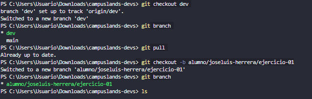
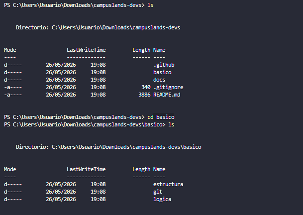
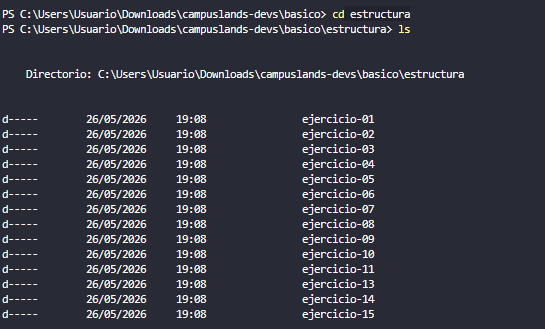
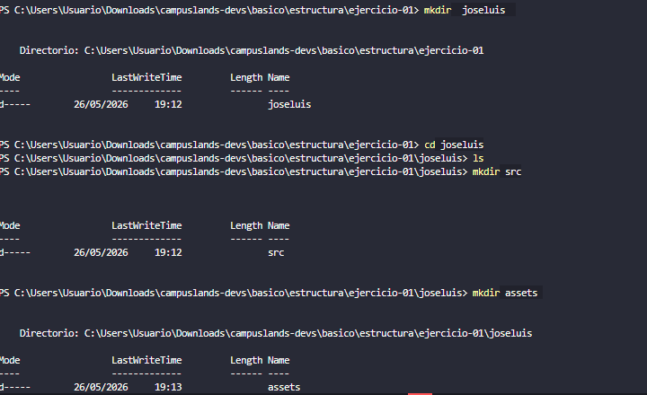
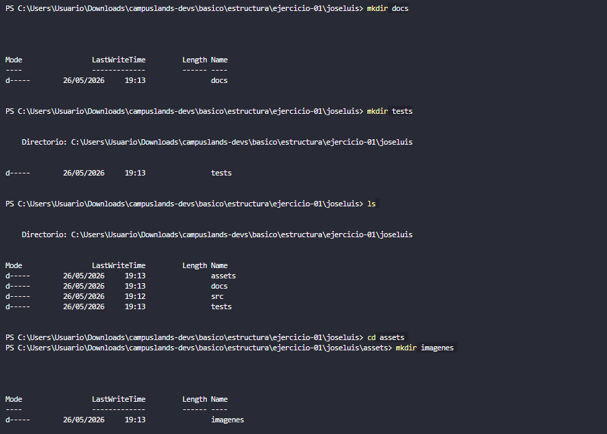

# Estructura de estudio indie de videojuegos

## Estructura
La estructura del proyecto de videojuegos se dividió de la siguiente manera: comenzando con la **creación** de una carpeta llamada `joseluis`, seguido por las subcarpetas obligatorias para organizar los recursos:
* `assets`: que contiene las carpetas `audio`, `imagenes` y `maps`.
* `docs`: para la documentación.
* `src`: para el código fuente.
* `tests`: para las pruebas del sistema.
Cada una de estas carpetas contiene un archivo `README.md` para definir la función de cada espacio de trabajo.

## Estructura Visual

## Proceso de Desarrollo 

### Creación de nuevas ramas

### Creacion de la estructura y archivos

