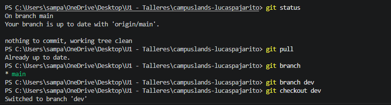
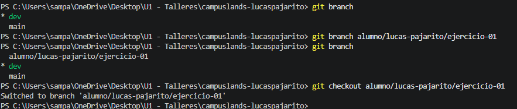
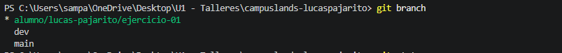
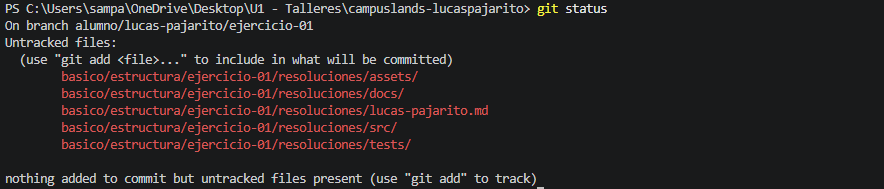

<p align="center">

</p>

# 🛠️Ejercicio de estructura 

En este ejercico se trabaja la organizacion de arcvivos, este estapa de la elaboracion del ejercicio es crucial para el orden de trabajos o proyectos reales, a continuacion breve explicación de cada carpeta y archivo incluido.
## 📁 Estructura del Proyecto

El proyecto sigue una organización de carpetas que facilita el mantenimiento, escalabilidad y separación de responsabilidades.

```text
📦 proyecto
├── assets
│   ├── audio
│   ├── img
│   └── maps
├── docs
├── src
│   ├── css
│   │   └── style.css
│   ├── html
│   │   └── index.html
│   └── js
│       └── main.js
└── tests
```

### 📂 assets

Contiene todos los recursos estáticos utilizados por la aplicación.

#### 📂 assets/audio
Almacena archivos de audio utilizados en el proyecto, como:

- Música de fondo.
- Efectos de sonido.
- Audios de notificaciones.
- Grabaciones o locuciones.

#### 📂 assets/img
Contiene todas las imágenes del proyecto:

- Logos.
- Íconos.
- Fotografías.
- Banners.
- Ilustraciones.

Mantener las imágenes en una carpeta independiente facilita su gestión y reutilización.

#### 📂 assets/maps
Almacena mapas, planos o recursos relacionados con ubicaciones geográficas.

Ejemplos:

- Imágenes de mapas.
- Archivos GeoJSON.
- Datos de coordenadas.
- Recursos para integración con APIs de mapas.

---

### 📂 docs

Contiene la documentación del proyecto.

Ejemplos:

- Diagramas.
- Manuales de usuario.
- Casos de uso.
- Wireframes.
- Requerimientos.
- Evidencias de desarrollo.

Esta carpeta permite mantener la documentación separada del código fuente.

---

### 📂 src

Contiene el código fuente principal de la aplicación.

#### 📂 src/css

Almacena las hojas de estilo del proyecto.

Archivo actual:

- `style.css`: contiene las reglas de diseño visual de la aplicación.

Responsabilidades:

- Colores.
- Tipografías.
- Layout.
- Animaciones.
- Diseño responsive.

---

#### 📂 src/html

Contiene las páginas HTML de la aplicación.

Archivo actual:

- `index.html`: estructura principal del sitio web.

Responsabilidades:

- Definir la estructura de la interfaz.
- Organizar el contenido mostrado al usuario.

---

#### 📂 src/js

Contiene la lógica de programación en JavaScript.

Archivo actual:

- `main.js`: controla el comportamiento dinámico de la aplicación.

Responsabilidades:

- Eventos.
- Manipulación del DOM.
- Validaciones.
- Consumo de APIs.
- Funcionalidades interactivas.

---

### 📂 tests

Contiene pruebas del proyecto para verificar que las funcionalidades funcionen correctamente.

Puede incluir:

- Pruebas unitarias.
- Pruebas de integración.
- Datos de prueba.
- Scripts de validación.

Su objetivo es garantizar la calidad y estabilidad del software.

---

### 📄 .gitkeep

Los archivos `.gitkeep` se utilizan para que Git pueda rastrear carpetas vacías.

Git no almacena directorios vacíos por defecto, por lo que este archivo permite mantener la estructura del proyecto desde el repositorio.

# 🧾Evidencia de flujo de trabajo



