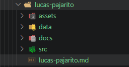

# Ejercicio 04 

## Autos de lujo
Este ejercicio esta diseñado para la practica de estructura de archivos que forman parte de un proyecto formal, se deben tomar en cuenta el oden y lugares donde corresponden los archivos correspondientes.

# Evidencia de estructura de carpetas.

- Estructura de las carpetas del proyecto.

- la carpeta `lucas-pajarito` es la carpeta de trabajo donde se agregan los archivos. y carpetas a utilizar.

## AUTOR

    LUCAS SAMUEL PAJARITO SUREK.