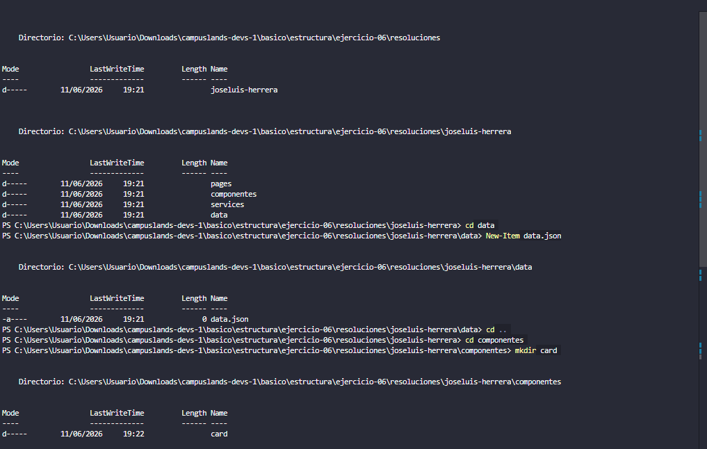
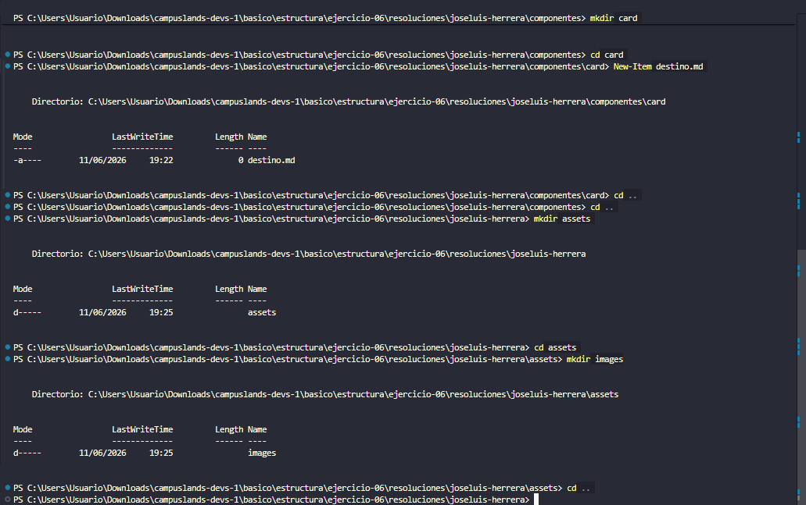

# APP de reservas turistica 

## Definicion
Se realizo la organizacion de los archivos de la app ademas de eso se cuenta con una estructura de archivos limpios en el cual se prioriza el dividir el proyectos en disntitas carpetas para tener un buen orden y una organizacion tambien en estas carpetas hay subcarpetas que son igual de importantes para continuar con el orden.

## Estructura Visual
```
📁joseluis-herrera
            └── 📁assets
                └── 📁images
                    ├── evidencias_part01.png
                    ├── evidencias_part02.png
            └── 📁componentes
                └── 📁card
                    ├── destino.md
            └── 📁data
                ├── data.json
            └── 📁pages
                ├── .gitkeep
            └── 📁services
                ├── .gitkeep
            ├── joseluis-herrera.md
        ├── .gitkeep
    └── README.md
```

## Como mejoraria el proyecto 
El proyecto podria mejorar de una manera en el cual se agreguen mas carpetas como para imagenes, para documentacion ademas de eso que cada en las carpetas que ya tenemos se lleve un orden si en compononentes se  piensa agregar algo nuevo que contenga una carpeta para eso nuevo y que no se metan archivos sueltos ademas de eso que tampoco se mezclen archivos entre carpetas que no se metan por ejemplo la carpeta de images en componentes si no que se vayan en orden y explicarle al cliente un poco sobre el uso de las carpetas y que archivos puede meter ahi. 

## Como se penso el problema
El problema se penso para que la estructura de la app se vea lo mejor organizada y estetica posible en el cual se prioriza el orden para el cliente y en un futuro no tenga problemas sobre la gestion de sus archivos o archivos mezclados entre carpetas ademas de eso se trato de una mejora sobre el proyecto como una recomendaciones sobre que archivos o subcarpetas puede crear en cada carpeta principal. 

## Comando usados 


