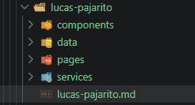

# Ejercicio 06  Estructura

### DESCRIPCION

Este ejercicio está diseñado para que practiques análisis, orden y toma de decisiones. Aunque pertenece al nivel básico, debes tratarlo como una tarea real: leer requisitos, transformar información en una solución y validar el resultado.

### EXPLICACION

Este ejercicio es una practica de ejecución de estructura de proyectos, el proyecto puede ir creciento de de acuerdo a las necesidades de los desarrolladores pueden irse agreagando carpetas como: `config`, `maps`, `docs`, etc.

## EVIDENCIA.

- Creación de las carpetas.

# AUTOR

LUCAS SAMUEL PAJARITO SUREK