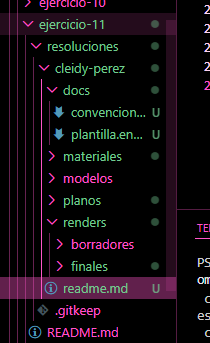

# Proyecto de Arquitectura 3D

## Nombre

Cleidy Pérez

## Objetivo

Organizar correctamente los archivos de un proyecto de arquitectura 3D separando planos, modelos, materiales, renders y documentación.

## Proceso

1. Crear la estructura de carpetas.
2. Separar borradores y finales.
3. Agregar la documentación.
4. Crear una plantilla de entrega.
5. Validar que la estructura cumpla los requisitos.

## Resultado

Se obtuvo una organización clara que facilita localizar los archivos del proyecto.

## Validación

Caso normal:
Todas las carpetas requeridas existen.

Caso límite:
La carpeta docs contiene los archivos obligatorios.