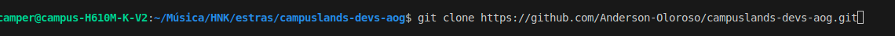
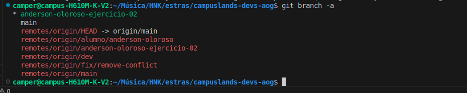

# Ejercicio 02 de resoluciones

## Nombre: _Henrik Anderson Oloroso García_

- Clonacion del repositorio

- Ejecutando git status

- Ejecutando git branch

- Ejecutando git log

- Crecacion del archivo md

