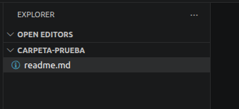
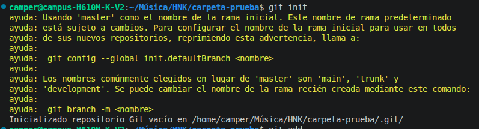
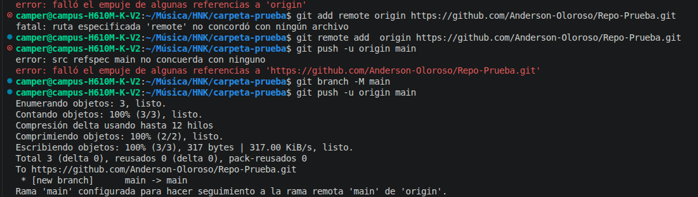
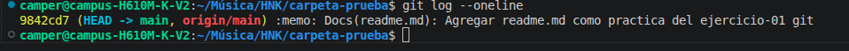
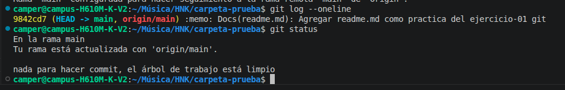

# Solucion Ejercicio-01 - Git
## Nombre: _Henrik Anderson Oloroso García_

- creadion de reame y carpeta de prueba

- Ejecutando el comando git init

- Agregar y hacer push al repo

- Ejecutando git log

- Ejecutando el comando git status

### Explicacion
El proyecto era crear un repo de prueba en el cual trabaje y segui los comandos necesarios y requeridos para este ejercicio en el cual tambien estan las imagenes evidenciadas del trayecto
