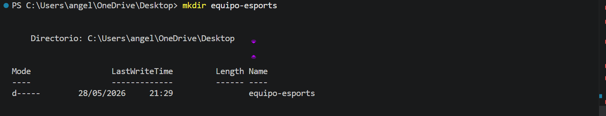
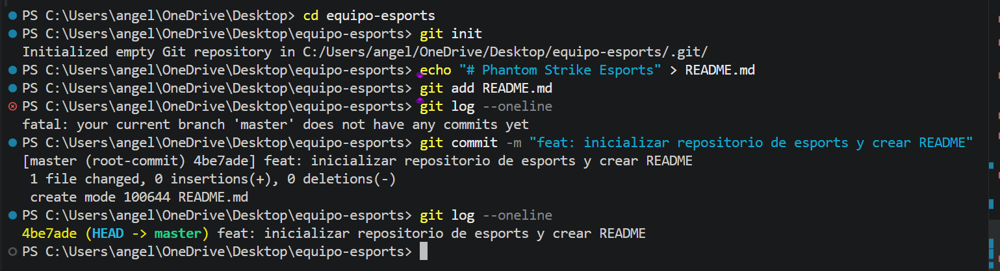

# Resolucion Ejercicio 01 - Inicializar repo de equipo esports

## Datos del Estudiante
- Nombre: Angela Arrivillaga

## Analisis del Problema
Para resolver este ejercicio de simulacion de un equipo de esports enfocado en shooters, decidi crear una carpeta totalmente externa llamada "equipo-esports" en el Escritorio. Esto asegura que el nuevo proyecto sea independiente y no interfiera con el repositorio base de la clase. Luego, inicialice el entorno de Git, cree un documento de presentacion y registre el primer cambio usando un mensaje estructurado de forma profesional.

## Proceso Paso a Paso y Comandos Usados

1. Creacion de la carpeta del proyecto fuera del repositorio base y acceso a ella:
mkdir equipo-esports
cd equipo-esports

2. Inicializacion del repositorio Git local:
git init

3. Creacion del archivo README.md inicial para el equipo:
echo "# Phantom Strike Esports" > README.md

4. Preparacion del archivo para el historial:
git add README.md

5. Registro del primer commit profesional con un mensaje descriptivo:
git commit -m "feat: inicializar repositorio de esports y crear README"

## Evidencia de Validacion
Comando ejecutado para comprobar el historial:
git log --oneline

Resultado real obtenido en la terminal:
4be7ade (HEAD -> master) feat: inicializar repositorio de esports y crear README

