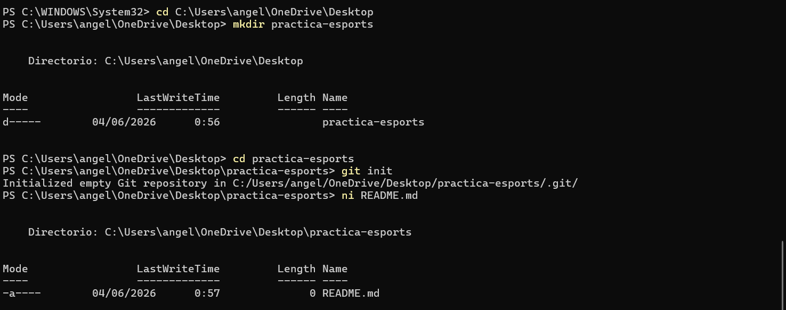
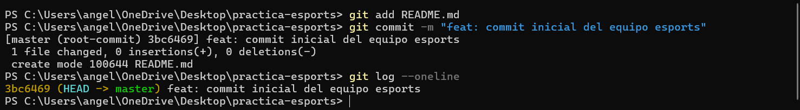

# 🎮 GIT

> **Ejercicio 01:** Inicializar Repositorio de Equipo Esports

## 👤 Desarrolladora
>**Angela Arrivillaga**  
*Estudiante en Campuslands - U1*

## 📝 Descripción
El objetivo de este ejercicio fue practicar la inicialización de un repositorio local mediante `git init` y realizar un primer commit estructurado. Simulamos un entorno de trabajo para un equipo de videojuegos shooters, trabajando de forma aislada para no interferir con el repositorio base del curso.

## 🚀 Proceso realizado
1. **Aislamiento**: Creé una carpeta `practica-esports` fuera del repositorio base.
2. **Inicialización**: Ejecuté `git init` dentro de la nueva carpeta.
3. **Documentación**: Generé el archivo `README.md` del equipo.
4. **Registro**: Realicé el primer commit con un mensaje semántico profesional.
5. **Evidencia**: Se verificó el historial mediante `git log --oneline`.

## 🔍 Evidencia de validación
Aquí presento las capturas de los pasos clave:

### 1. Inicialización y estructura

### 2. Historial de commits (`git log --oneline`)

## ✅ Validación
- [x] Repositorio inicializado fuera del repo base.
- [x] Archivo `README.md` creado.
- [x] Primer commit realizado con mensaje claro.
- [x] Evidencia de `git log` incluida correctamente.
- [x] Entregable ubicado en: `basico/git/ejercicio-01/resoluciones/angela-arrivillaga/`