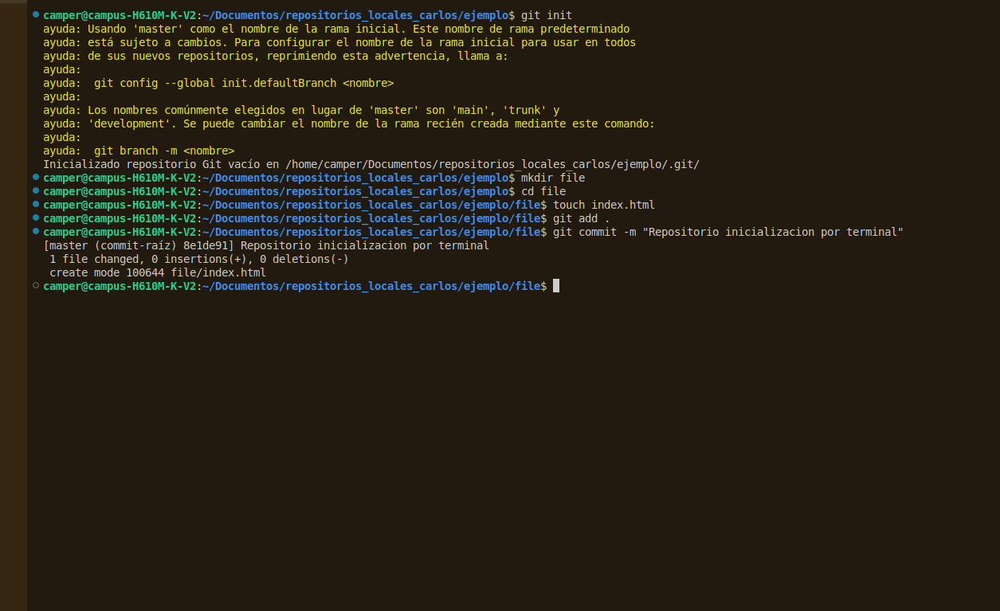

# ejercicio 01 git
```markdown
# Inicialización de Repositorio Git
Este repositorio fue inicializado desde la terminal siguiendo estos pasos:

1. **Inicializar el repositorio:**
   ```bash
   git init

```

2. **Crear carpeta y acceder a ella:**
```bash
mkdir file
cd file

```


3. **Crear archivo inicial:**
```bash
touch index.html

```


4. **Preparar y guardar cambios (commit):**
```bash
git add .
git commit -m "Repositorio inicializacion por terminal"

```
## evidencia


**Creado por:**  _carlos velasco_ 