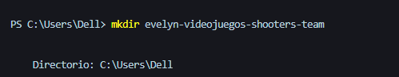
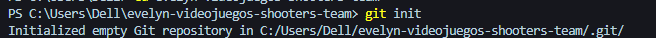
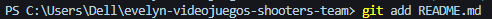
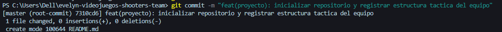
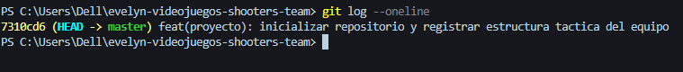
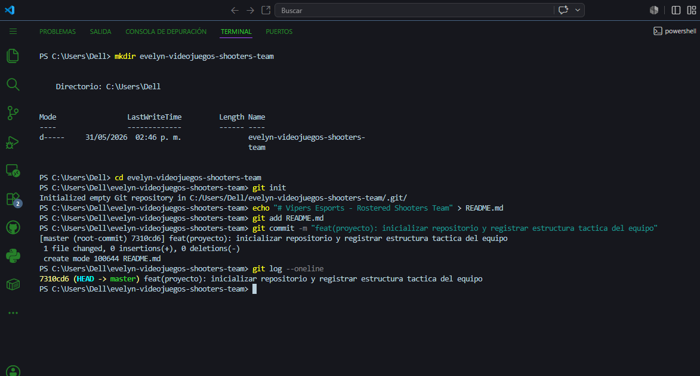

# Solución: Inicialización de Repositorio - Equipo de Esports (Shooters)

**Desarrollador:** Evelyn Barrios
**Temática:** Videojuegos Shooters

## Explicación del Razonamiento
en este ejercicio se realizo una simulación de un equipo de trabajo inicializando un repositorio aparte segun las instrucciones

----

## Explicación Técnica de los Comandos Ejecutados

A continuación, se detalla el propósito y la justificación de cada comando utilizado en la terminal durante el laboratorio de práctica, tal como se evidencia en la imagen de abajo:

### 1. `mkdir evelyn-videojuegos-shooters-team`
*   **Propósito:** Crear un nuevo directorio en el sistema de archivos local.
*   **Explicación técnica:** Este comando crea una carpeta limpia y dedicada fuera del proyecto principal para el laboratorio. Se utilizó el nombre sugerido por el contexto para identificar claramente el proyecto del equipo de shooters.

### 2. `cd evelyn-videojuegos-shooters-team`
*   **Propósito:** Cambiar el directorio de trabajo actual de la terminal.
*   **Explicación técnica:** Nos posiciona dentro de la carpeta recién creada. Es un paso obligatorio antes de ejecutar cualquier comando de Git, asegurando que los cambios se apliquen estrictamente en el espacio de trabajo correcto.

### 3. `git init`
*   **Propósito:** Inicializar un repositorio de Git vacío.
*   **Explicación técnica:** Este comando transforma una carpeta común en un repositorio controlado por versiones, creando el directorio oculto `.git`. A partir de este momento, Git tiene la capacidad de rastrear los cambios, estados e historial de los archivos que se creen aquí adentro.

### 4. `echo "# Vipers Esports - Rostered Shooters Team" > README.md`
*   **Propósito:** Crear un archivo de texto en formato Markdown con contenido inicial.
*   **Explicación técnica:** Genera el archivo base de documentación (`README.md`) que funcionará como la carta de identidad táctica del equipo de esports. Al ser un archivo nuevo, entra directamente al estado de *Untracked* (no rastreado) en Git.

### 5. `git add README.md`
*   **Propósito:** Registrar y preparar el archivo en el área de indexación.
*   **Explicación técnica:** Mueve el archivo del estado *Untracked* al estado *Staged*. Con esto le indicamos a Git que este archivo y sus cambios específicos están listos para ser incluidos de forma oficial en la próxima confirmación del historial.

### 6. `git commit -m "feat(proyecto): inicializar repositorio y registrar estructura tactica del equipo"`
*   **Propósito:** Guardar permanentemente los cambios preparados en el historial del repositorio.
*   **Explicación técnica:** Consolida el estado actual del proyecto creando un punto de control inmutable con un identificador único.

### 7. `git log --oneline`
*   **Propósito:** Mostrar el historial de confirmaciones de forma simplificada.
*   **Explicación técnica:** Despliega los commits realizados en la rama activa mostrando únicamente los primeros 7 caracteres del Hash SHA-1 y el mensaje asociado.  para validar que el historial está limpio y correctamente registrado.

---

## Evidencia de Validación

Como se observa en el flujo real de la terminal, el repositorio local quedó inicializado con éxito, esto según lo que pedian las instrucciones del ejercicio:

