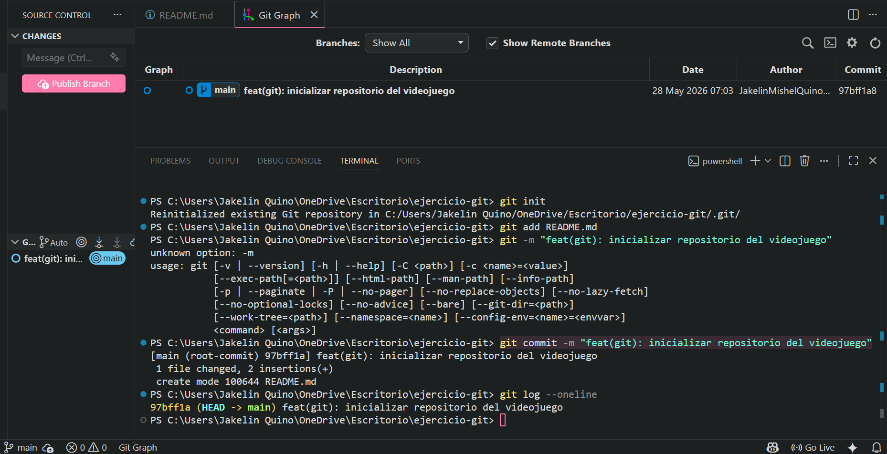

# Solución: Inicializar repo de equipo eSports

## 1. Explicación del razonamiento
Para simular el entorno de trabajo de un equipo de eSports de shooters, creé una carpeta nueva fuera del proyecto.

## 2. Comandos ejecutados y Evidencia

```bash
# 1. Creación de carpeta e inicialización
C:\Users\JakelinQuino\OneDrive\Escritorio\ejercicio-git>
git init

# 2. Creación del archivo base
README.md

# 3. Registro del primer commit
git add README.md
git commit -m "feat(git): inicializar repositorio del videojuego"
```

## Evidencia

