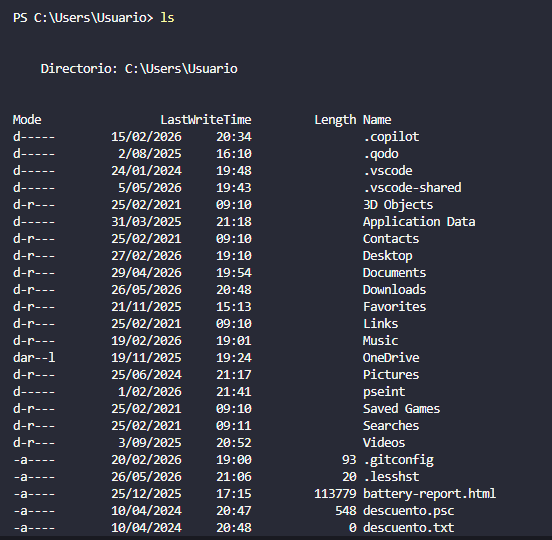
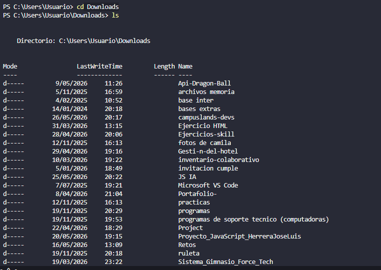
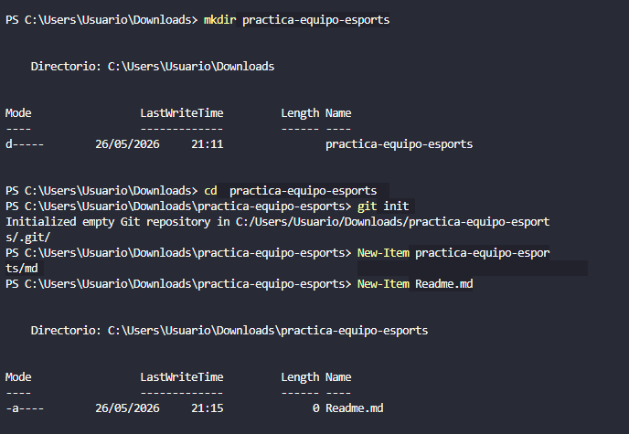
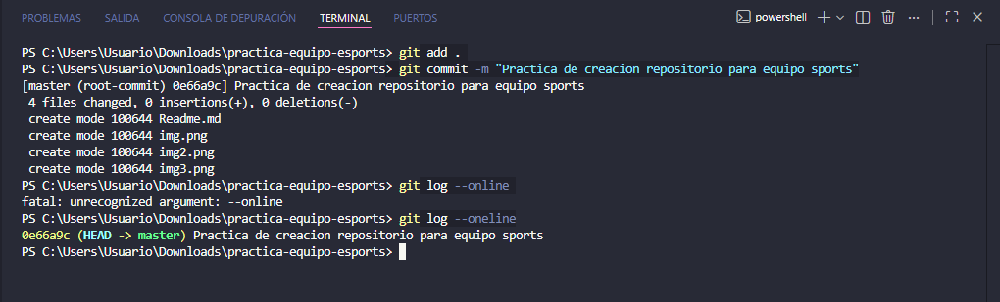

# Práctica de Inicialización de Repositorio

## Solución
La solución a este problema consistió en crear una carpeta totalmente independiente en una nueva ventana de Visual Studio Code. En este espacio, se realizó una práctica guiada para inicializar un repositorio Git desde cero, utilizando comandos directamente en la terminal como `git init`.

## Explicación
Para resolver el ejercicio correctamente, decidí abrir una ventana separado para cumplir con el requisito de trabajar fuera del repositorio base actual. 

El proceso que seguí desde la terminal de PowerShell (`PS C:\Users\Usuario>`) fue el siguiente:
1. Utilicé el comando `ls` (o `dir`) para listar los directorios y ubicarme en la ruta correcta.
2. Navegué con `cd` hacia la ubicación elegida para el nuevo proyecto.
3. Creé la carpeta destinada al repositorio e inicialicé el entorno de Git.
4. Cumplí secuencialmente con cada uno de los parámetros solicitados (creación del archivo `README.md`, preparación con `git add` y el guardado con `git commit`).

A lo largo de todo el proceso, fui recopilando capturas de pantalla de la terminal como evidencia del uso correcto de cada comando.

## Proceso de Desarrollo 

### Creación de nueva carpeta

### Creacion de nuevo repositorio

