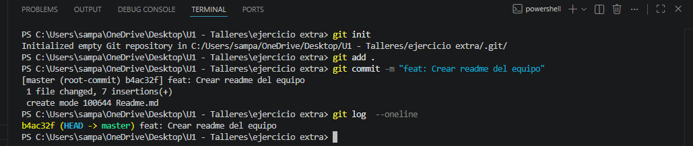

# Ejercicio de Git
Este ejercicio esta basado en simulacion de trabajo colaborativo poniendo en prática los comando de git.

# Evidencias de elaboracion de ejercicio.
En la imagen se puede observar la evidencia de elaboracion de el trabajo solicitado.

