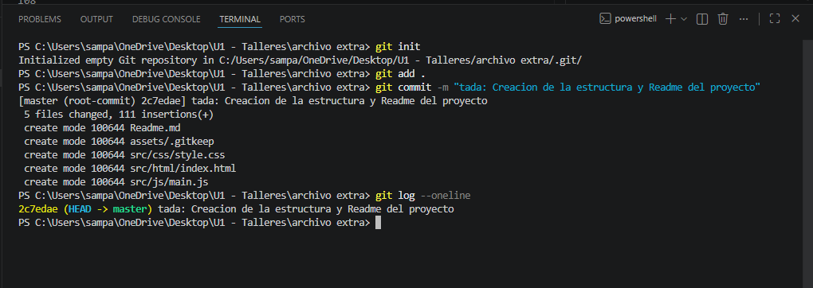

# 📘 Práctica Básica de Git

## 🎯 Objetivo

Realizar una práctica introductoria para comprender el flujo básico de trabajo con Git, incluyendo la inicialización de un repositorio, el seguimiento de archivos, la creación de commits y la consulta del historial de cambios.

---

## 📋 Actividades Realizadas

### 1. Creación de una carpeta de práctica

Se creó una carpeta independiente fuera del repositorio base para trabajar de manera aislada.

```bash
mkdir practica-git
cd practica-git
```

---

### 2. Inicialización del repositorio

Se inicializó un nuevo repositorio local utilizando Git.

```bash
git init
```

Resultado esperado:

```text
Initialized empty Git repository
```

---

### 3. Creación del archivo README.md

Se creó un archivo README para documentar la práctica.

```bash
touch README.md
```

Contenido inicial:

```md
# Equipo Shooter

Repositorio de práctica para aprender los fundamentos de Git.
```

---

### 4. Agregar archivos y realizar commit

Se agregó el archivo al área de preparación y posteriormente se creó el primer commit.

```bash
git add README.md
git commit -m "docs: agregar README inicial del equipo"
```

---

### 5. Evidencia del historial

Se verificó el historial de commits mediante el comando:

```bash
git log --oneline
```

Ejemplo de salida:

```text
a1b2c3d docs: agregar README inicial del equipo
```

---

## 🛠 Comandos Utilizados

| Comando                   | Descripción                                      |
| ------------------------- | ------------------------------------------------ |
| `git init`                | Inicializa un nuevo repositorio Git.             |
| `git add README.md`       | Agrega el archivo al área de preparación.        |
| `git commit -m "mensaje"` | Guarda los cambios en el historial del proyecto. |
| `git log --oneline`       | Muestra un resumen del historial de commits.     |

---

## ✅ Resultado

Al finalizar la práctica se logró:

* Crear un repositorio local.
* Crear y documentar un archivo README.
* Registrar cambios mediante commits.
* Consultar el historial del proyecto.
* Comprender el flujo básico de trabajo con Git.

# Evidicencia del trabajo de Git

