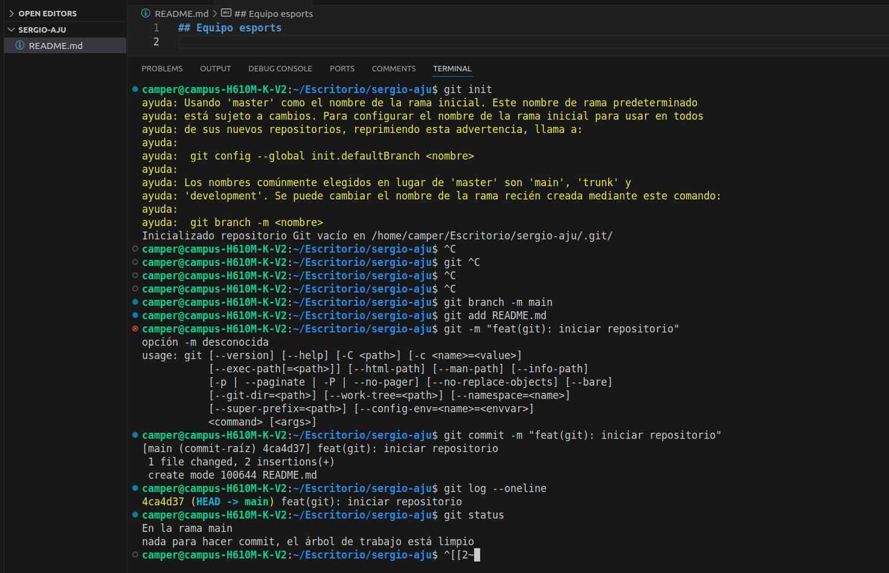

# 🎮 Proyecto: Gestión de Equipo de Esports

## 👤 Información del Desarrollador
* **Nombre:** Sergio Ajú
* **Rol:** Backend Developer
* **Estado del Repositorio:** Inicializado en la rama principal (`main`)

---

## 🚀 Sobre el Proyecto
Este repositorio está diseñado para construir la estructura lógica y la gestión de datos para un equipo profesional de **Esports** (Deportes Electrónicos). El sistema se enfocará en organizar la información clave de los jugadores, alineaciones, estadísticas de juego y torneos competitivos.

---

## 🛠️ Bitácora de Inicialización del Entorno (Git)

Como buena práctica de desarrollo, el repositorio fue configurado desde la terminal siguiendo el estándar de commits semánticos. A continuación se documentan los comandos iniciales ejecutados:

```bash
# 1. Inicializar un repositorio Git local vacío
git init

# 2. Renombrar la rama por defecto de 'master' a 'main'
git branch -m main

# 3. Preparar el archivo de documentación inicial
git add README.md

# 4. Crear el commit raíz con la estructura convencional (Conventional Commits)
git commit -m "feat(git): iniciar repositorio"

# 5. Validar el historial y el estado limpio del árbol de trabajo
git log --online
git status 
```

