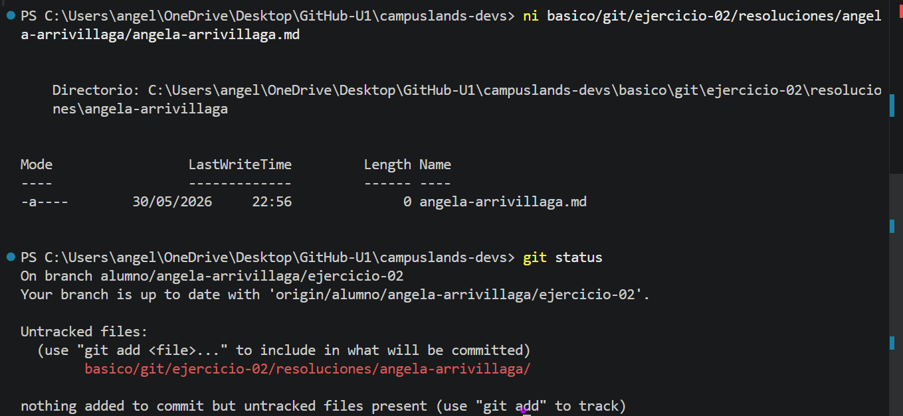

# Solución de Ejercicio 02 - Clonar Base de Torneo RPG

**Estudiante:** Angela Arrivillaga  
**Nivel:** Básico Retador  

## 🧠 Explicación del Razonamiento y Conceptos de Git

Para integrarse con éxito a un equipo de desarrollo profesional, no basta con memorizar comandos; es vital entender qué ocurre detrás de escena con las herramientas de control de versiones.

### 1. ¿Qué es y cómo funciona `git clone`?
El comando `git clone` no es una simple descarga de archivos. Este comando toma un repositorio remoto completo que está alojado en la nube (como GitHub) y crea una copia exacta e idéntica en el disco duro local de nuestra computadora. 
* **Qué incluye:** Descarga todos los archivos del proyecto, pero también arrastra todo el historial de cambios, todos los commits pasados, las etiquetas y todas las ramas que los demás desarrolladores han creado a lo largo del tiempo.
* **Problema que resuelve:** Permite que un desarrollador nuevo obtenga una estación de trabajo idéntica a la del resto del equipo para empezar a colaborar de inmediato sin perder el rastro de lo que se hizo antes.

### 2. ¿Qué es y cómo funciona `git status`?
El comando `git status` actúa como el inspector o auditor en tiempo real de nuestro entorno de trabajo. Nos da un reporte detallado del estado actual del repositorio local comparándolo con el último commit registrado.
* **Qué nos dice:** Nos informa en qué rama estamos parados actualmente, si nuestra rama está al día con el servidor remoto, qué archivos han sido modificados pero no guardados, qué archivos están listos en la zona de preparación (*Staging Area*) y qué archivos son completamente nuevos y no tienen seguimiento (*Untracked files*).
* **Problema que resuelve:** Evita que guardemos archivos por accidente, que subamos basura al código de producción, o que trabajemos a ciegas sin saber qué cambios reales hemos hecho en el proyecto.

---

## 🛠️ Flujo de Trabajo y Comandos Utilizados

### 1. Descarga inicial con `git clone`
Primero, utilizamos el comando `git clone` seguido de la URL del repositorio. Este comando se encarga de descargar una copia exacta de todo el proyecto y su historial desde GitHub a nuestra computadora para poder empezar a trabajar.

### 2. Control del estado con `git status`
Luego de entrar a la carpeta, ejecutamos el comando `git status`. Hacemos esto para auditar el estado del proyecto; nos sirve para identificar en qué rama estamos parados y ver qué archivos hemos modificado o cuáles son completamente nuevos antes de guardarlos.

