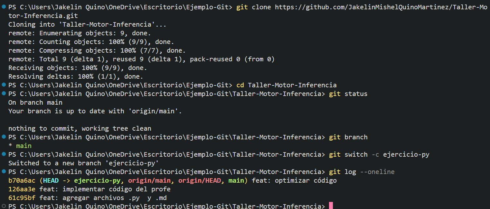

# Ejercicio 02: Git

## Comandos utilizados
```bash
# 1. Clonar repositorio
C:\Users\JakelinQuino\OneDrive\Escritorio\Ejemplo-Git> git init

# 2. Entrar a la carpeta
C:\Users\Jakelin Quino\OneDrive\Escritorio\Ejemplo-Git> cd Taller-Motor-Inferencia

# 3. Ver el estado del repositorio
C:\Users\Jakelin Quino\OneDrive\Escritorio\Ejemplo-Git\Taller-Motor-Inferencia> git status

# 4. Visualizar ramas que tiene el repositorio
C:\Users\Jakelin Quino\OneDrive\Escritorio\Ejemplo-Git\Taller-Motor-Inferencia> git branch

# 5. crear una nueva rama
C:\Users\Jakelin Quino\OneDrive\Escritorio\Ejemplo-Git\Taller-Motor-Inferencia> git switch -c ejercicio-py

# 6. Resumen de los commits realizados
C:\Users\Jakelin Quino\OneDrive\Escritorio\Ejemplo-Git\Taller-Motor-Inferencia> git log --oneline

```
## Evidencia del uso de comandos
