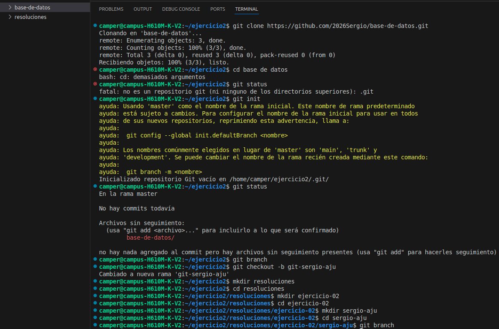

# Resolución: Ejercicio 02 - Clonación y Exploración Inicial (RPG)

**Alumno:** Sergio Aju  
**Fecha:** 10 de junio de 2026

## 1. Descripción del problema
El objetivo de este ejercicio es practicar el flujo de trabajo colaborativo con Git, específicamente mediante la clonación de un repositorio, la identificación de la rama actual y la configuración de una estructura de entrega organizada y profesional.

## 2. Proceso de resolución
1. **Clonación:** Se utilizó el comando `git clone` para obtener una copia local del repositorio del instructor.
2. **Navegación y diagnóstico:** - Se ingresó al directorio del proyecto.
   - Se ejecutó `git status` para verificar el estado del árbol de trabajo.
   - Se identificó la rama actual mediante `git branch`.
3. **Estructuración:** Se creó la ruta de entrega solicitada: `basico/git/ejercicio-02/resoluciones/sergio-aju/`.
4. **Documentación:** Se generó este archivo `sergio-aju.md` para registrar el proceso.

## 3. Evidencia de validación
A continuación, los comandos ejecutados para la exploración inicial:

```bash

git clone <url-del-repositorio>
cd campuslands-devs
git status
git branch

