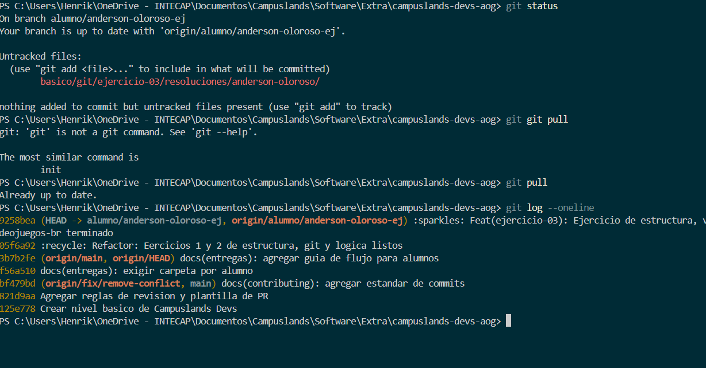

# Ejercicio - 03 Git

## Henrik Anderson Olorso García

_Comandos Git a utilizar_
- `git status`
- `git pull`
- `git log --oneline`
- `git add .`
- `git commit -m ""`
- `git push -u origin nombre-rama`