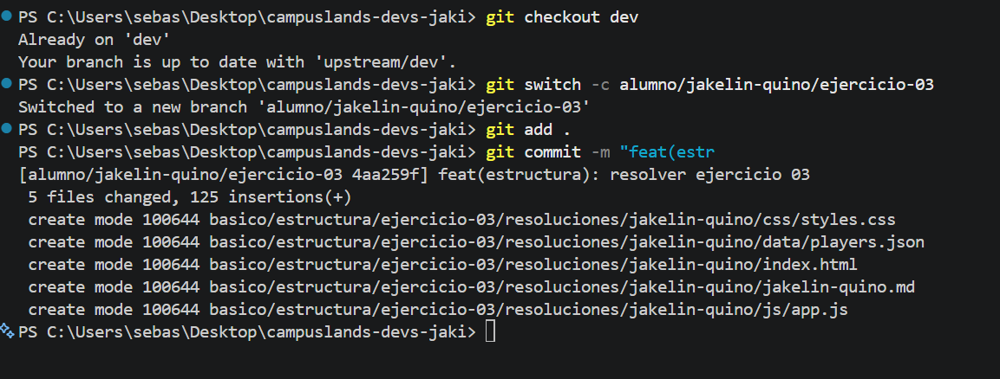

# Ejercicio 03: Git

## Comandos utilizados
```bash
# 1. Moverse a la rama 'dev'
C:\Users\sebas\Desktop\campuslands-devs-jaki> git checkout dev

# 2. Crear y moverse a una nueva rama sobre 'dev'
C:\Users\sebas\Desktop\campuslands-devs-jaki> switch -c alumno/jakelin-quino/ejercicio-03

# 3. Luego de resolver el ejercicio agrgegar todos los cambios al 'Staged Area'
C:\Users\sebas\Desktop\campuslands-devs-jaki> git add .

# 4. Agregar commit sobre los cambios realizados
C:\Users\sebas\Desktop\campuslands-devs-jaki> git commit -m "feat(estructura): resolver ejercicio 03"

```
## Evidencia del uso de comandos
