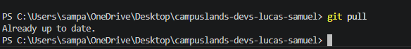
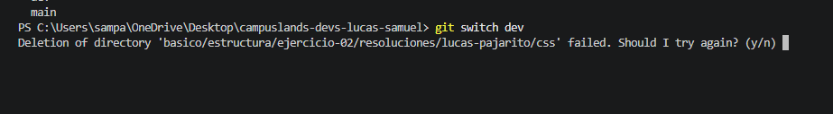
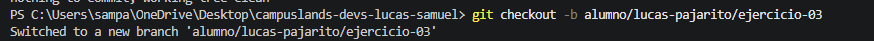

# Ejercicio 03 De Git

# Explicacion del Flujo de trabajo.

1. `Git pull` 
    El uso de este comando es par la actualizacion la copia local del proyecto con los cambios que existen en el repositorio remoto.

2. `Git switch / checkout ` 
Para la funcion de cambiar entre ramas usamos los comandos **git switch** ó **git checkout** ambos realizan la misma función.

    Estos mismos comandos son los que utilizamos para crear nuevas ramas, la uncia diferecia es que a cada uno de estos comando se le debe una bandera en este caso **_-c_** para **SWITCH** y para **CHECKOUT** se utiliza _**-b**_.

# Autor

    Lucas Samuel Pajarito Surek