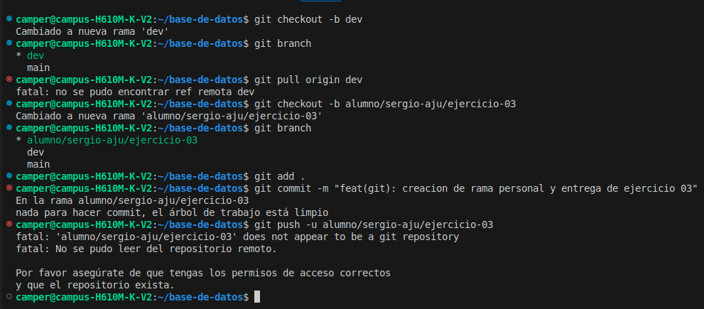

# Resolución: Ejercicio 03 - Creación de Rama y Flujo de Trabajo (MOBA)

**Alumno:** Sergio Aju  
**Fecha:** 10 de junio de 2026

## 1. Descripción del problema
El objetivo es implementar una nueva funcionalidad o estructura basándose en el flujo de trabajo *Git Flow*, garantizando que no se realicen cambios directos sobre la rama `main` y manteniendo el proyecto sincronizado con la rama de desarrollo (`dev`).

## 2. Proceso de resolución
1. **Sincronización:** Me posicioné en la rama `dev` y realicé un `git pull` para asegurar que mi entorno local tuviera los cambios más recientes del repositorio.
2. **Creación de rama:** Creé una rama específica siguiendo la nomenclatura requerida: `alumno/sergio-aju/ejercicio-03`.
3. **Estructuración:** Generé la carpeta `resoluciones/sergio-aju/` y añadí los archivos correspondientes.
4. **Confirmación:** Realicé un *commit* con un mensaje descriptivo y profesional siguiendo las convenciones de *commitlint*.

## 3. Evidencia de comandos
Para documentar el proceso, ejecute lo siguiente:


```bash

git checkout dev
git pull origin dev


git checkout -b alumno/sergio-aju/ejercicio-03

git add .
git commit -m "feat(git): creacion de rama personal y entrega de ejercicio 03"


