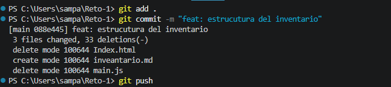
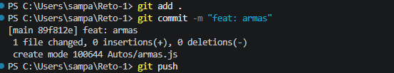
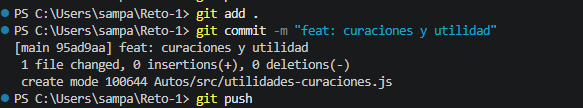

# Ejercicio 04 GIT

# DESCRIPCION 
Este ejercicio consta de comprender los comandos de git, para la elaboracion de proyectos de manera grupal, de tal manera que durante los proyectos de minimize los errores y conflictos.

# EVIDENCIAS

- Crear archivo `inventario.md`

- Primer commit

- Tegundo commit

- Tercer commit 

- Historial

# AUTOR

    LUCAS SAMUEL PAJARITO SUREK.