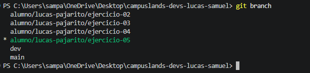
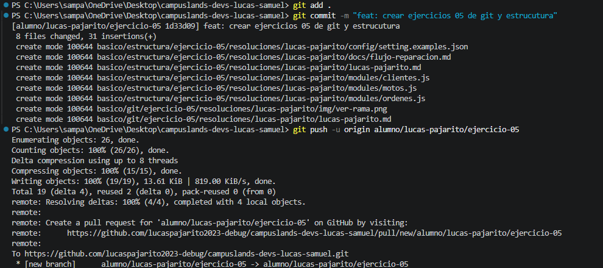
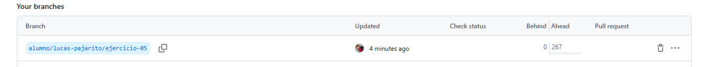

# Ejercicio 05 Git

## Objetivo.

Subir una rama personal al remoto.

## Descripcion / Evidencias.

El trabajo esta diseñado para la practica de trabajo en grupo, el principal objetivo es la mitigacion de errores y conflictos al momento de trabajar con repositorios grupales.

- Verificar si estoy en mi rama

- Commit y push

- Rama existente en repositorio.

# AUTOR 

    LUCAS SAMUEL PAJARITO SUREK