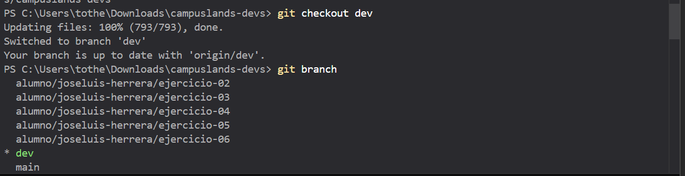
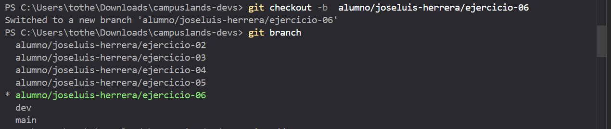

## Explicación porque git pull evita conflictos 
al hacer un git pull en la rama dev se estara garantizando que la nueva rama que sera creada nacera con los cambios actualizados evitando conflictos si esque no hacemos el git pull y solo creamos la rama nacera con los cambios antiguos y al hacer un git pull en la dev se creara un conflicto donde posiblemente no se pueda hacer un merge. 

