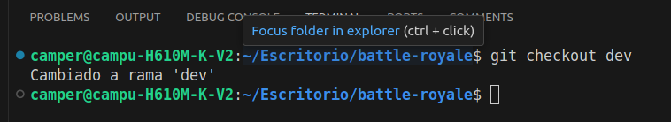
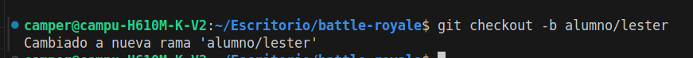

# Simulacion de trabajo colaborativo en un repositorio de git.
## Comprobacion que git pull reduce conflictos.

### Alumno:Lester Garcia.

## Evidencia
1. La imagen representa en la terminal el cambio de rama, especificamente a dev.

2. La imagen representa la creacion de una nueva rama desde la terminal.

### ¿Por que git pull reduce conflictos?

**git pull** : En realidad, git pull no reduce los conflictos por sí mismo, pero su uso frecuente es la mejor estrategia para evitarlos.

Recordemos que git pull es la combinación de dos acciones automáticas: git fetch (descargar los cambios del servidor) y git merge (fusionarlos con los archivos locales).

   Hacer git pull reduce la aparición de conflictos complejos por lo siguiente:

**Integración temprana**: Al traer los cambios de tus compañeros (o de tu profesor) todos los días antes de empezar a programar, trabajas sobre la versión más reciente del código.

**Conflictos más pequeños**:  Si tú y otra persona modifican el mismo archivo, resolver un conflicto de un par de líneas que se subieron ayer es infinitamente más fácil que resolver un conflicto de cientos de líneas acumuladas durante semanas.

**Evita el código obsoleto**:  Te asegura que no pases horas escribiendo una solución sobre una base de código o un archivo que otra persona ya borró, cambió o reestructuró en el servidor remoto.