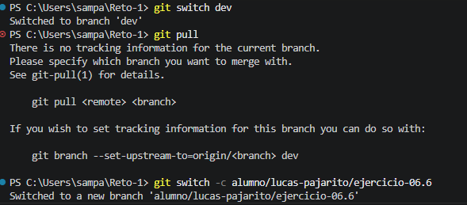

# Ejercicio 06 Git

### DESCRIPCION
Este ejercicio está diseñado para que practiques análisis, orden y toma de decisiones. Aunque pertenece al nivel básico, debes tratarlo como una tarea real: leer requisitos, transformar información en una solución y validar el resultado.

# EVIDENCIA

- Cambio a dev
- Git pull
- Crear rama

# AUTOR

    LUCAS SAMUEL PAJARITO SUREK