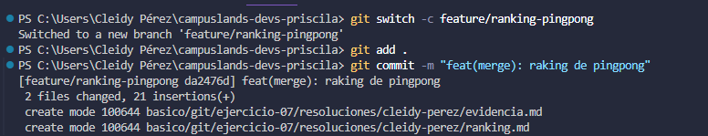
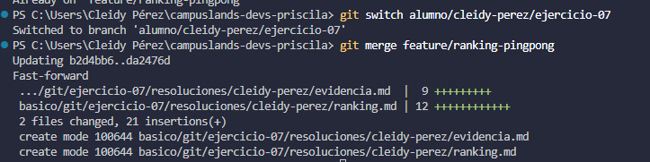

# Merge de ranking de pingpong
Dificultad

## Básica retadora
## Nombre
- Cleidy Prisicila Pérez Casia

## Temática usada
pingpong

## Una breve explicación de cómo pensaste el problema
- Para trabajar colaborativa debe que cada miembro pueda crear un rama para que el trabaja que se realiza en cada rama pueda solo en el local de los miembros cuando el trabajo, está correcto se realiza un merge para que se una el trabajo con la rama principal y esto hace que el trabajo este en la misma rama.

## Evidencia de validación cuando aplique.
### Gits utilizados
- Git switch -c: para crear la rama y esta ubicado en esa rama.
- Git add .: para aguardarlo.
- Git commit -m: para nombrar lo que se realizón en esa rama.
- Git switch: para ubicarse en la rama que se require realizar el merge. 
    Ejemplo: 
         - git switch alumno/cleidy-perez/ejercicio-07
- Git merge: para unir la tarea realizada.
    Ejemplo:
        - git merge feature/ranking-pingpong

Con este git merge se actualiza la rama que se realizó en la rama crea con la rama principla.

