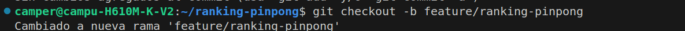
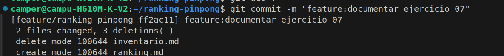
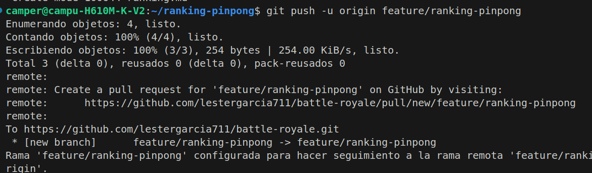
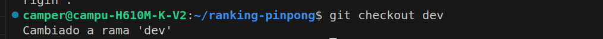
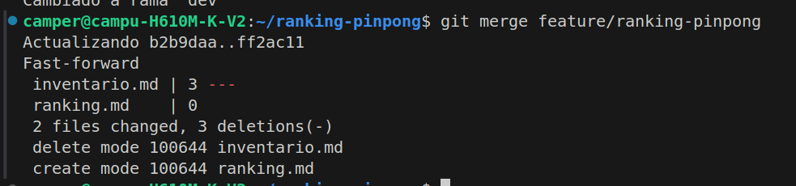

c
1. La imagen representa la creacion de una nueva rama en el repositorio local.

2. La imagen representa la realizacion de un commit dentro de la rama.

3. La imagen representa la actualizacion de la rama con los cambios o modificaciones hechas.

.

4.La imagen representa el cambio de rama local.En este caso a `dev´.

5.La imagen representa la actualizacion de la rama creada con la rama local dev.

