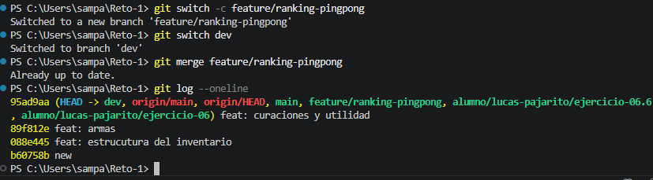

# Ejercicio 07 

# Descripcion

Este ejercicio está diseñado para que practiques análisis, orden y toma de decisiones. Aunque pertenece al nivel básico, debes tratarlo como una tarea real: leer requisitos, transformar información en una solución y validar el resultado.

# Evidencia

- Evidencia de lo elaborado.

# Autor

    LUCAS SAMUEL PAJARITO SUREK
    