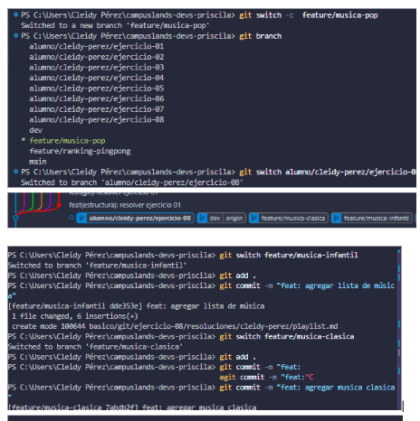
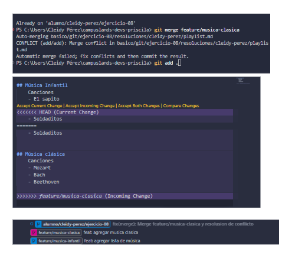

# Conflicto simple en playlist musical
## Dificultad
Básica retadora

## Nombre
- Cleidy Priscila Pérez Casia

## Temática usada
música

## Una breve explicación de cómo pensaste el problema.
    CONFLICTOS:
    1. Cuando realizé en primer merge con la rama, todo funcionó bien, pero cuando uní el segundo merge no me permitía, entonces para solucionar ese problema en donde estan la caperta de cleidy-perez me me salía error en el playlist.md entonces para que se que se puediera realizar el merge debia borrar las <<<<<<<<<< y las ------- para poder realizar el merge pero en este caso ya no se debia usar el merge solo git add . y git commit y con esto se realizaba el merge. 

## Evidencia de validación cuando aplique.

Ahí se empezó el conflicto del segundo merge que iba realizar:
     Solucion:
     - Borrar las lineas que aparecen en en el readme playlist.
     - Git add .
     - Git commit -m
     Con esto se soluciona el conflicto y se ejecuta de una vez el merge.
