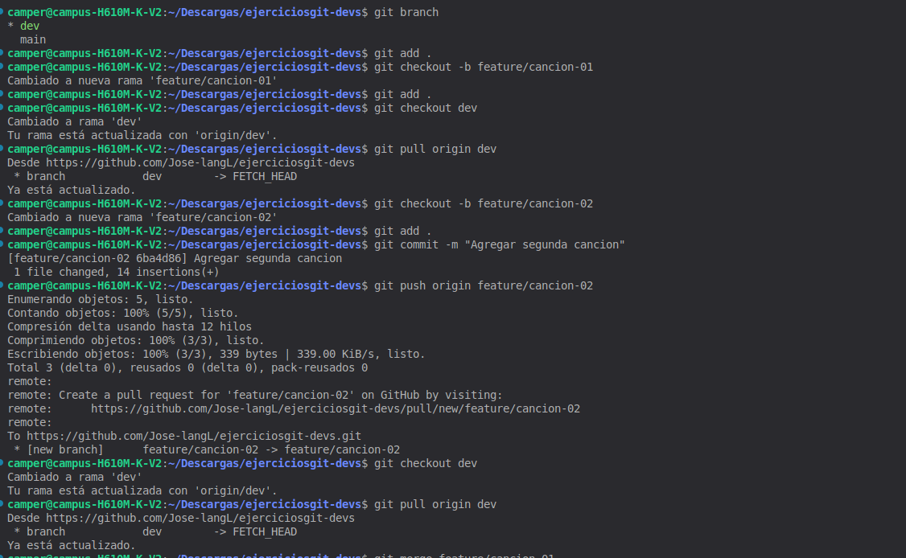
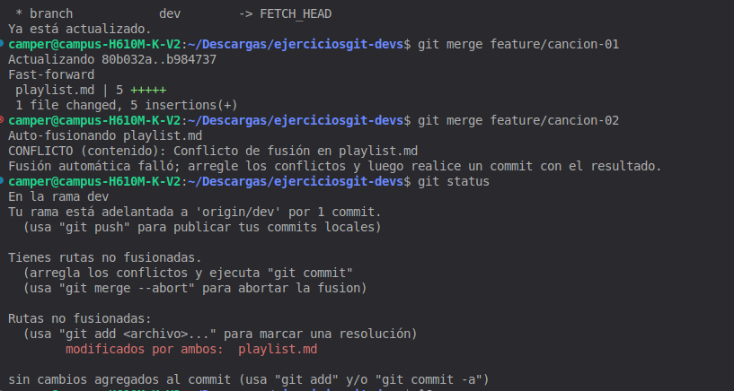
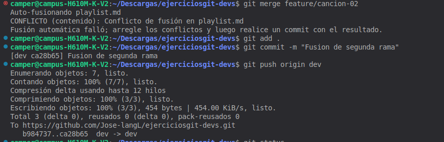

# Ejercio 08

# Explicacion
En el siguiente ejercicio se realizo un ejercicio de git en el cual se tenia que crear una playlist de musica, ademas de eso desde un punto 
especifico se tenia que crear 2 ramas diferentes y crear un conflicto a la fusion de una rama y luego de eso resolver el conflicto.

## Imagen 1
En esta primera imagen se puede observar como se crean las 2 ramas
partiendo de la rama de git dev.

## Imagen 2 
En esta segunda imagen hacemos la primera fusion de la rama todo bien, observamos que al hacer merge en la segunda rama se nota que 
nos dio un conflicto.

## Solucion
Como resolvi el conflicto primero guarde los cambios de la primera fusion luego los envie con un git push orign dev, luego fusione la 2da rama y hice un git add ., git commit y envie los cambios.

