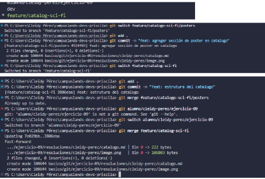

# Trabajo con ramas sobre ramas en película sci-fi

## Dificultad
Básica retadora

## Nombre:
- Cleidy Priscila Pérez Casia

## Temática usada
películas y ciencia ficción

## Una breve explicación de cómo pensaste el problema.
- Primero queria que las ramas se trabajaran cada uno una parte del proyecto, enonces para eso se debia crear carpetas relacionada a lo que se iba a trabaja, despues de realizar el trabajo se aguardan y en la rama que se quiere realizar el merge se coloca y realizar el merge y todo lo que se trabajaron la otra rama se actualizar con los datos que se encuentran ahí.

## Evidencia de validación cuando aplique.
- git switch -c para crear la rama.
- git add .: para aguarda los cambios.
- git commit -m : para colocarle un nombre o instrucciones de lo que se realizó en esa rama.
- git merge para unir el trabajo con la otra rama.
