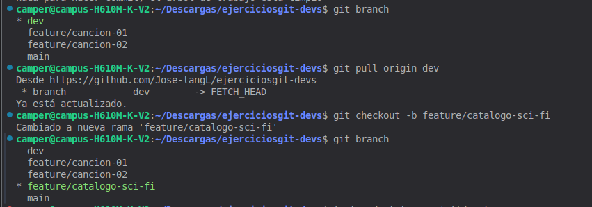
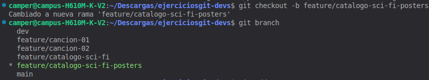
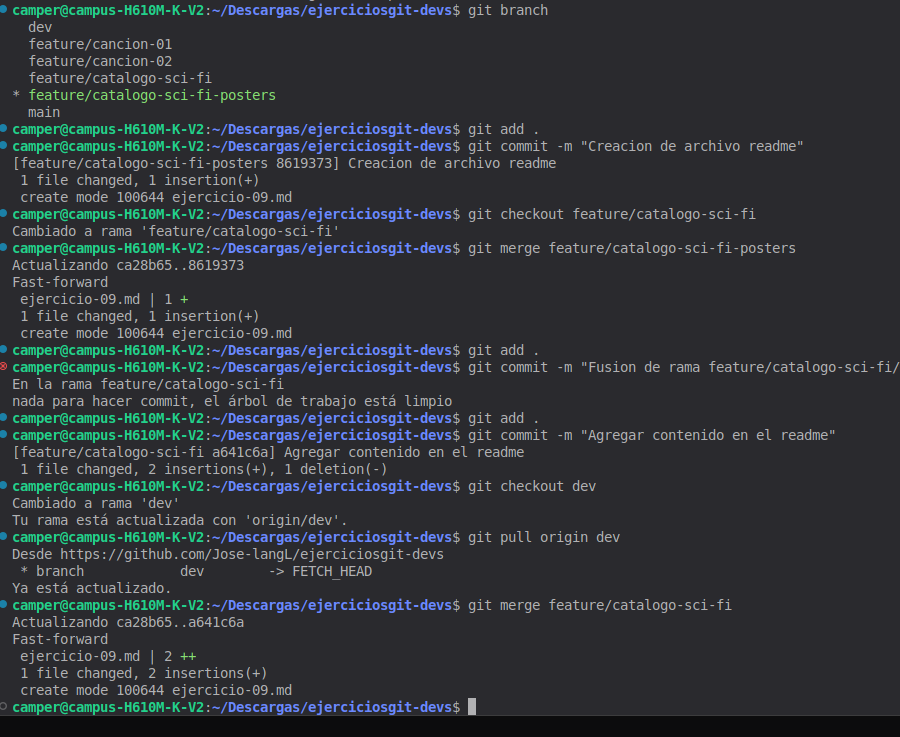

# Ejercicio 09

## Como pense el problema 
Primero pense en hacer un repositorio solo para los ejercicios de git y github asi llevo un control de las ramas y commits que haga y asi no
modifico nada de mi repositorio el cual es un fork.

Luego lei las instrucciones del problema y llegue a la solucion de como puedo hacer el ejercicio entonces como tenia que seguir una serie de
pasos que eran moverme entre ramas y hacer commits los cuales ya mas o menos tenia la idea asi fue como logre hacer el ejercicio.

## Solucion
Primero se verifico si estaba en la rama dev 
luego de eso se creo la rama feature/catalogo-sci-fi
luego se verifico si se creo la rama con un git branch

En esa misma rama se creo la segunda rama que se solicitaba 

luego de eso se realizo lo solicitado del ejercicio que era hacer commits y un merge de la rama dev 
