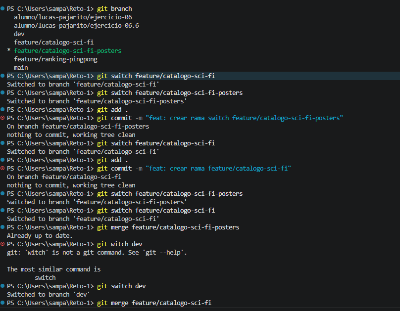

# Ejercicio: Trabajo con Ramas Jerárquicas en Git

## Objetivo

Aprender a trabajar con ramas derivadas de otras ramas (ramas jerárquicas), realizar cambios independientes y fusionarlas en el orden correcto para mantener un historial organizado.

Al finalizar este ejercicio podrás:

- Crear ramas a partir de otras ramas.
- Realizar commits independientes.
- Fusionar una rama secundaria en su rama principal.
- Integrar posteriormente los cambios en la rama de desarrollo (`dev`).

---

# Requisitos

- Tener Git instalado.
- Contar con un repositorio inicializado.
- Disponer de una rama `dev`.

Si aún no existe la rama `dev`, créala con:

```bash
git checkout -b dev
```

Verifica las ramas disponibles:

```bash
git branch
```

---

# Paso 1. Crear la rama `feature/catalogo-sci-fi`

Posiciónate sobre la rama `dev`:

```bash
git checkout dev
```

Crea la nueva rama:

```bash
git checkout -b feature/catalogo-sci-fi
```

Esta rama será la encargada del desarrollo del catálogo de ciencia ficción.

---

# Paso 2. Crear la rama `feature/catalogo-sci-fi/posters`

Sin regresar a `dev`, crea una nueva rama partiendo de `feature/catalogo-sci-fi`:

```bash
git checkout -b feature/catalogo-sci-fi/posters
```

Esta rama contendrá únicamente el desarrollo relacionado con los pósters del catálogo.

La jerarquía quedará así:

```text
dev
└── feature/catalogo-sci-fi
    └── feature/catalogo-sci-fi/posters
```

---

# Paso 3. Realizar commits separados

## En la rama `feature/catalogo-sci-fi/posters`

Agregar o modificar archivos relacionados con los pósters.

Guardar los cambios:

```bash
git add .
git commit -m "Agregar posters del catálogo Sci-Fi"
```

---

## Regresar a la rama principal de la funcionalidad

```bash
git checkout feature/catalogo-sci-fi
```

Agregar cambios relacionados con el catálogo.

Guardar los cambios:

```bash
git add .
git commit -m "Agregar estructura del catálogo Sci-Fi"
```

De esta manera, ambas ramas tendrán su propio historial de cambios.

---

# Paso 4. Fusionar la rama secundaria

Estando en la rama principal de la funcionalidad:

```bash
git checkout feature/catalogo-sci-fi
```

Fusionar la rama hija:

```bash
git merge feature/catalogo-sci-fi/posters
```

Ahora `feature/catalogo-sci-fi` contiene tanto sus propios cambios como los realizados en la rama de pósters.

---

# Paso 5. Fusionar la rama principal en `dev`

Cambiar a la rama de desarrollo:

```bash
git checkout dev
```

Fusionar la funcionalidad completa:

```bash
git merge feature/catalogo-sci-fi
```

Con esto, todos los cambios del catálogo y de los pósters quedarán integrados en `dev`.

---

# Visualizar el historial

Para comprobar la estructura de las ramas y los merges:

```bash
git log --graph --decorate --oneline --all
```

Un resultado similar podría verse así:

```text
*   Merge branch 'feature/catalogo-sci-fi'
|\
| * Merge branch 'feature/catalogo-sci-fi/posters'
| |\
| | * Agregar posters del catálogo Sci-Fi
| * | Agregar estructura del catálogo Sci-Fi
|/
* Commit anterior en dev
```

---

# Comandos utilizados

```bash
git checkout dev
git checkout -b feature/catalogo-sci-fi
git checkout -b feature/catalogo-sci-fi/posters

git add .
git commit -m "Agregar posters del catálogo Sci-Fi"

git checkout feature/catalogo-sci-fi
git add .
git commit -m "Agregar estructura del catálogo Sci-Fi"

git merge feature/catalogo-sci-fi/posters

git checkout dev
git merge feature/catalogo-sci-fi

git log --graph --decorate --oneline --all
```

---

# Resultado esperado

Al finalizar este ejercicio habrás aprendido a:

- Crear ramas derivadas de otras ramas.
- Organizar funcionalidades complejas en subramas.
- Realizar commits independientes para cada tarea.
- Fusionar primero una rama secundaria con su rama principal.
- Integrar posteriormente la funcionalidad completa en la rama de desarrollo (`dev`).

Este flujo de trabajo es una práctica común en equipos de desarrollo, ya que permite dividir una funcionalidad grande en tareas más pequeñas y mantener un historial de cambios claro y ordenado.

# EVIDENCIAS


