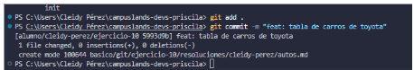
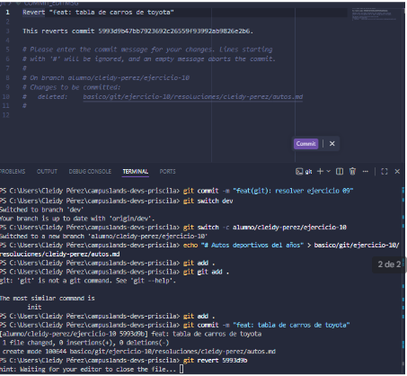

# Revertir idea sin borrar historial

## Dificultad
Básica retadora

## Nombre 
- Cleidy Priscila Pérez Casia

## Temática usada
autos

## Una breve explicación de cómo pensaste el problema.
- Cuando uno se equivoca con el contenido o en la descripción del commit no hay con ctrl + z para regresar pero si existe el git revert para eliminar los cambios que se realicen  en ese commit por que esto elimina los archivos, carpeta y el commit que se realiza dentro de ese commit.

## Evidencia de validación cuando aplique.
- git add . : para aguardar lo cambios.
- git commit -m: para nombrar a lo que se realizó.
- git revert para eliminar los cambios de ese commit.
    Ejemplo:
    git revert n5993d9b

