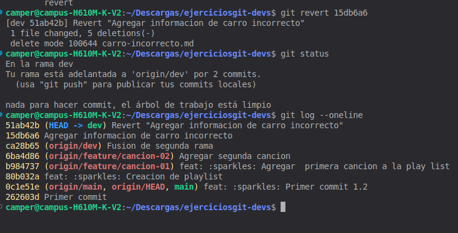

# Ejercicio 10

## Como pense el problema
Primero me puse a investigar como se usaba git revert y luego de verificar cual era su funcion me puse a ver como lo podria poner en practica 
con el ejercicio que me piden a la primera no me habia salido y cree un conflicto pero luego de una practica ya me salio 

## Imagenes de evidencia
Primero se crearon los datos de un carro incorrecto donde podemos observar que guardamos los cambios.

Luego se utilizo el comando git resert donde verificamos exactamente que si funciono porque elimino nuestro archivo readme del carro ademas de eso 
en el historial podemos observar que al lado del commit dice rever eso nos indica que ahi se utilizo ese comando

## Explicacion de porque se revert se guarda en el historial
El comando git revert se guarda en el historial porque no elimina ni modifica los commits existentes, sino que crea un nuevo commit que deshace los cambios realizados por un commit anterior. Esto permite mantener un registro completo de las modificaciones realizadas en el proyecto, incluyendo qué cambios fueron revertidos y cuándo ocurrió la reversión.