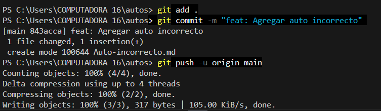
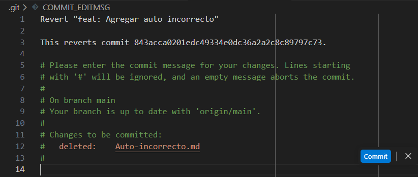
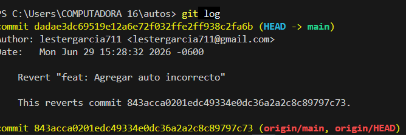

# Uso del **git revert** y lo que lo difernrcia de **`git reset`**

### Alumno:Lester Garcia.

## Evidencia:

## Explicacion:

**El comando `git revert`** : conserva el historial porque no altera el pasado ni borra los commits anteriores, sino que avanza en la línea del tiempo creando un **nuevo commit** que aplica exactamente los cambios inversos al commit que se desea eliminar. Desde una perspectiva profesional y de trabajo en equipo, esto es fundamental por dos razones: primero, actúa como una medida de seguridad que evita conflictos masivos y problemas de sincronización, ya que si usáramos un comando destructivo  como **`git reset`** para reescribir el pasado, desalinearíamos nuestro historial con el de los demás programadores que ya descargaron ese código; segundo, funciona como un registro de auditoría transparente que permite al equipo entender en el futuro qué falló, cuándo se introdujo el error y cómo se solucionó, garantizando la integridad del proyecto sin interrumpir el flujo colaborativo.