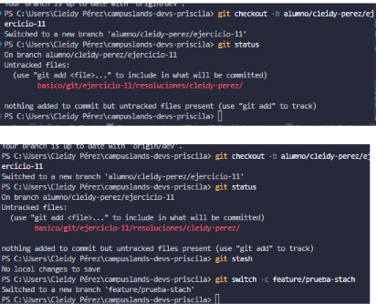
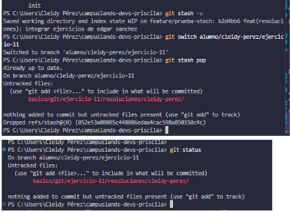

# Stash durante urgencia de kickboxing
## Dificultad
Básica retadora
## Nombre
Cleidy Priscila Pérez Casia

## Temática usada
kickboxing

## Una breve explicación de cómo pensaste el problema.
Muchas veces queremos aguardar archivos temporalmente o solo que se aguarden por un momento sin necesidad de hacer git commit para que se aguarde los cambio, entonces para esto se utiliza el git stash y cuando necesitamos eso lo que se realizo utilizamos git stash pop para recuperar lo que se aguardó temporalmente.

## Evidencia de validación cuando aplique.
- git stash -u: para guardar los cambios de la rama y recuperarlo después.
- git stash pop: para recuperar los que se habia a guardado temperalmente.

