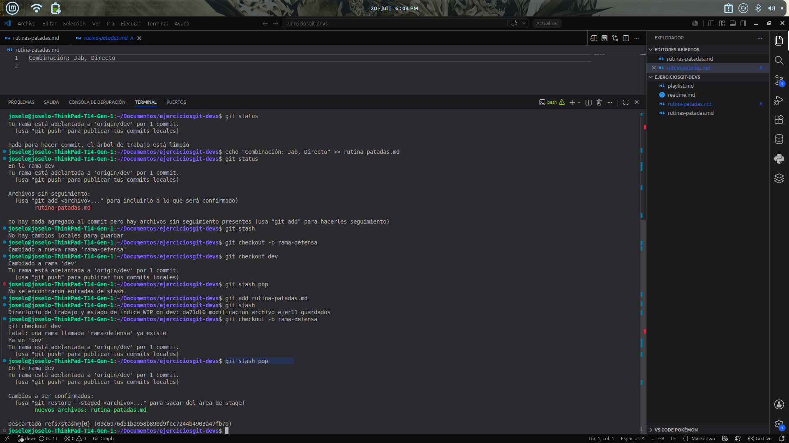

# Ejercicio 11 

# Explicacion 
Se completó un ejercicio práctico de Git enfocado en la gestión de cambios temporales. El procedimiento consistió en modificar un archivo en formato Markdown, el cual fue preparado mediante el área de seguimiento para poder utilizar el comando git stash y almacenar los cambios provisionales de forma limpia. Posteriormente, se realizó un cambio de rama para simular otra tarea y se recuperó el trabajo guardado aplicando git stash pop en el flujo correspondiente.

# Consola y comandos 

# Explicación 
Se ejecutó con éxito una práctica de control de versiones utilizando Git para gestionar cambios provisionales dentro de un entorno de desarrollo. El flujo y su resolución técnica se detallan a continuación:

Preparación y Resguardo Temporal: Se añadió el archivo rutina-patadas.md al área de seguimiento (staging area) y se aplicó el comando git stash para almacenar de forma segura los cambios pendientes sin alterar el historial con commits incompletos.

Gestión de Ramas: Durante la simulación del cambio de tarea, se detectó un conflicto operativo menor al intentar recrear una rama existente (rama-defensa), el cual se resolvió manteniendo el flujo activo sobre la rama principal de trabajo (dev).

Restauración del Trabajo: Se utilizó el comando git stash pop para extraer y aplicar los cambios resguardados de vuelta en el directorio de trabajo, recuperando de forma íntegra los archivos listos para su validación final.