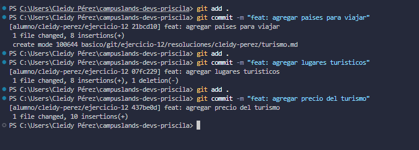

# Buenas prácticas de mensajes para turismo
## Dificultad
Básica retadora

## Nombre
- Cleidy Priscila Pérez Casia

## Temática usada
viajes y turismo

## Una breve explicación de cómo pensaste el problema.
- Para que las persona pueda entender lo que realizé en los commits debo ser breve y coherente de lo que se escribe para que toda persona que vea mi commit pueda entednder lo que hice par eso se debe utilizar un verbo para especificar lo realizado y una descripción breve.

## Evidencia de validación cuando aplique.
git add . : para guardar los cambios.
git commit -m : para nombrar ese cambio pero en el commit se debe utilizar palabra clave que la personas pueda entender lo que se hizo, para eso se debe empezar con verbo.

