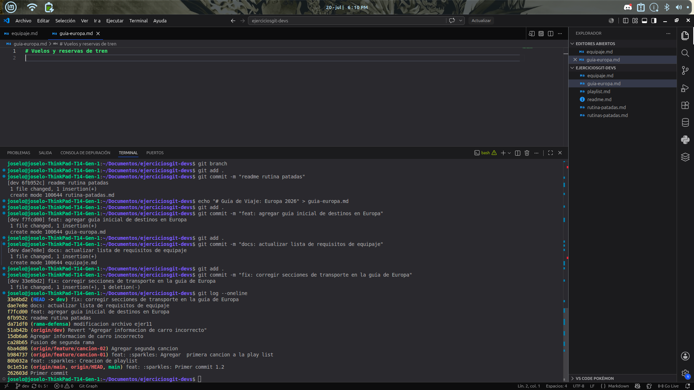

# Ejercicio 12

# Explicacion 
Se desarrolló un ejercicio práctico enfocado en el control de versiones y el registro de cambios incrementales mediante la creación y modificación de archivos en formato Markdown. Durante el proceso, se aplicaron confirmaciones (commits) estructuradas y se utilizó el comando git log --oneline para validar el historial y comprobar la trazabilidad de las modificaciones en el repositorio.

# imagenes 

