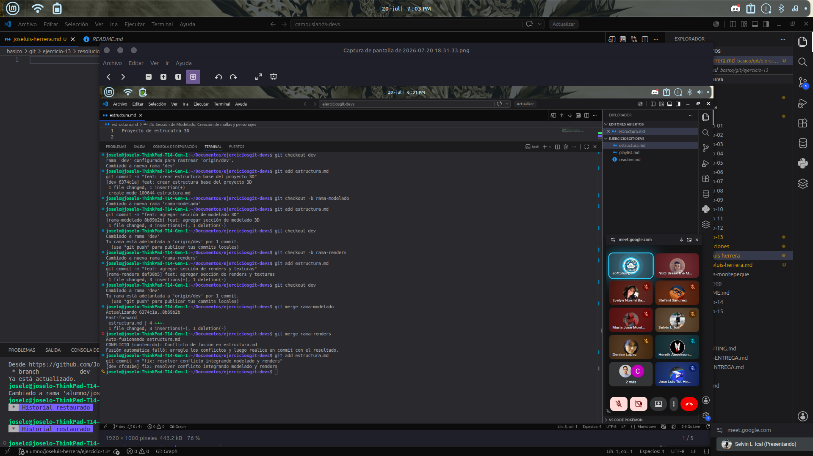

# Ejercicio 13

# Explicacion
Se desarrolló un ejercicio de simulación de trabajo colaborativo enfocado en la resolución de conflictos en Git bajo la temática de animación 3D. El procedimiento abarcó los siguientes puntos clave:

Ramificación y Edición Paralela: Se crearon ramas independientes para simular áreas de trabajo simultáneas (rama-modelado y rama-renders), modificando un mismo archivo base (estructura.md).

Generación del Conflicto: Al intentar fusionar ambos trabajos en el flujo principal, Git identificó modificaciones concurrentes en las mismas líneas, generando un punto de conflicto controlado.

Resolución e Integración: Se editó el archivo de forma manual para conservar armónicamente las aportaciones de ambas áreas (modelado y renders) y se cerró la fusión mediante un commit de resolución definitivo.

