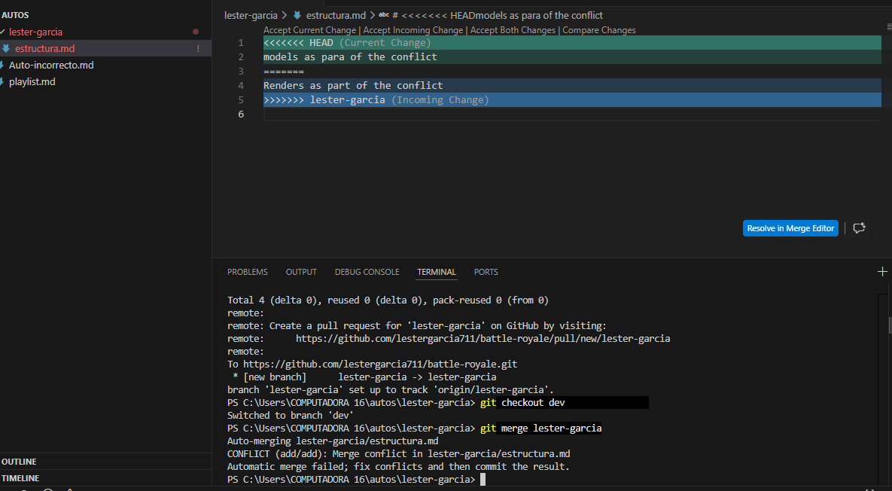
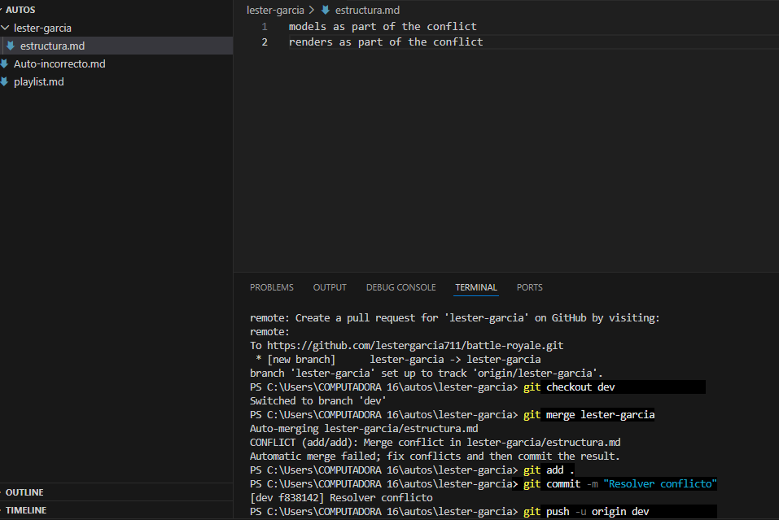

## Resolviendo conflicto enter dos ramas con una misma modificacion en la misma linea
### Alumno:Lester Garcia

### Descripcion:
Se crearon dos ramas, con un archivo llamado igual.Modificaciones de codigo en la misma linea.
Cuando se hizo el merge genero conflicto.Por ende se corrigio y se hizo un nuevo commit.Ese nuevo commit fue enviado hacia dev de una vez.

## Evidencia

