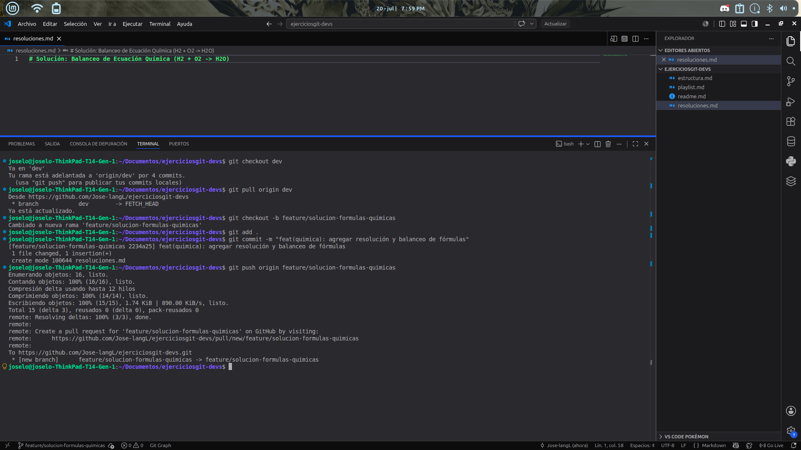

# Ejercicio 14

# Explicacion 
En este ejercicio se simuló un flujo de trabajo colaborativo para la preparación de una entrega mediante un Pull Request (PR) enfocado en fórmulas químicas. Esto permitió aplicar comandos de Git para crear una rama personal de desarrollo, registrar la solución en una carpeta específica de entregas, consolidar los cambios con un commit y subirlos al repositorio remoto (push), culminando con la redacción de una descripción estructurada que detalla el objetivo, los cambios realizados y la validación técnica del equipo.

