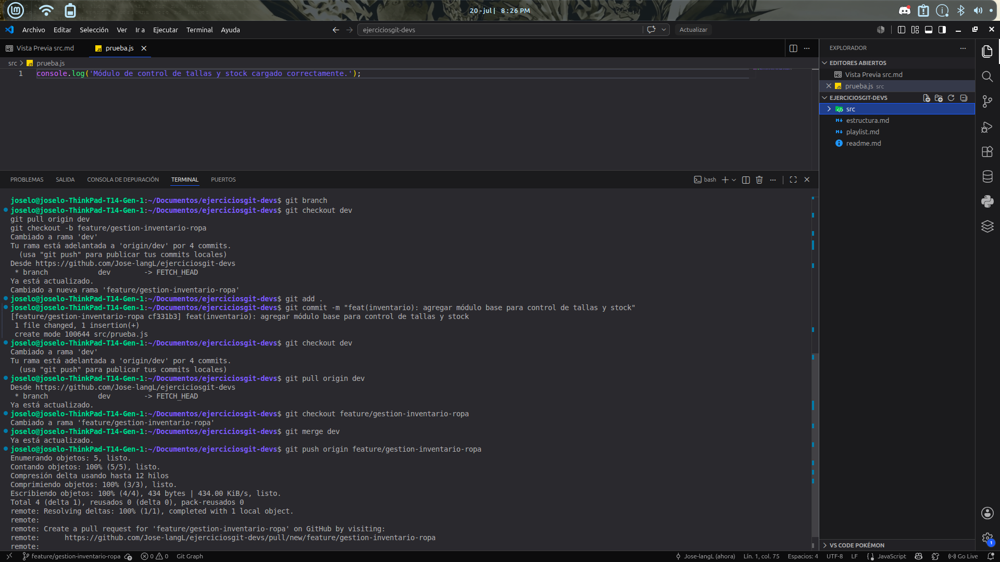

# Ejercicio 15

# Explicacion 
En este ejercicio se simuló un flujo de trabajo colaborativo profesional mediante Git enfocado en un proyecto de ropa. Esto permitió aplicar comandos para crear una rama independiente a partir de dev, desarrollar una solución acotada, registrar los cambios mediante un commit descriptivo, sincronizar el entorno local con las actualizaciones recientes de la rama de desarrollo para prevenir conflictos, y finalmente preparar un repositorio remoto junto con un checklist de verificación para garantizar una entrega profesional.

