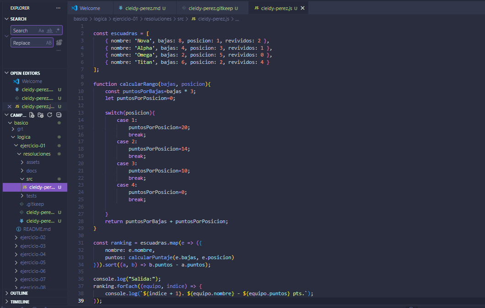

# Ranking de escuadras battle royale

### Dificultad
Media

### Nombre
Cleidy Priscial Pérez Casia

## Solución

- Crear un array
- Recorder los datos
- Realizar la funcion que calcule
- Mostrar los resultados del ranking

## Explicación de cómo pensaste el problema
Primero necesitaba datos para poder realizar esto, necesito recorder por los datos para saber quien podria estar en en ranking, pero esto se debia hacer una suma con los datos, y establecer el puntaje maximo y minimo para tener una referencia de las posiciones.

## Evidencia

## Comandos utilizados
 -Git init
 -git pull
 -git status
 -git log
 - git push
 -git merge