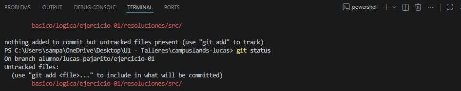
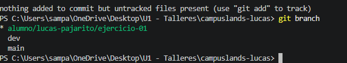

# 🪖Ranking Battle Royale

El ejercicio de ranking de battle royale pretende garantizar la practica de logica, uso de ciclos y condicionales, en este ejercicio se tenia contemplado quenerar una tabla de puntajes y creacion de arrays y su recorrido. 

# Evidencias de uso de Git

 
  